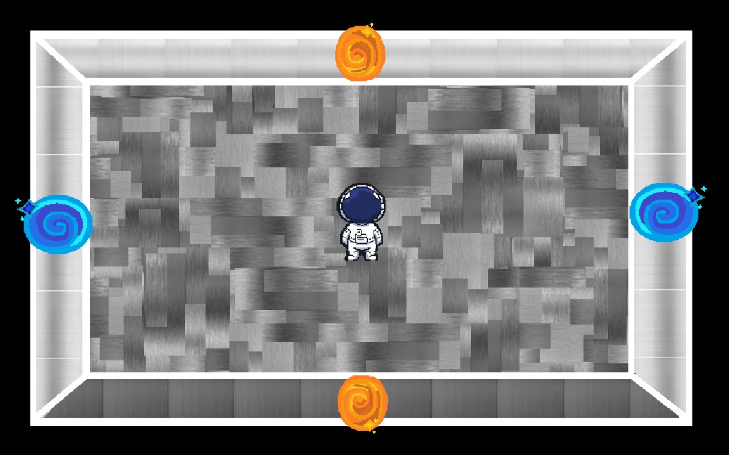
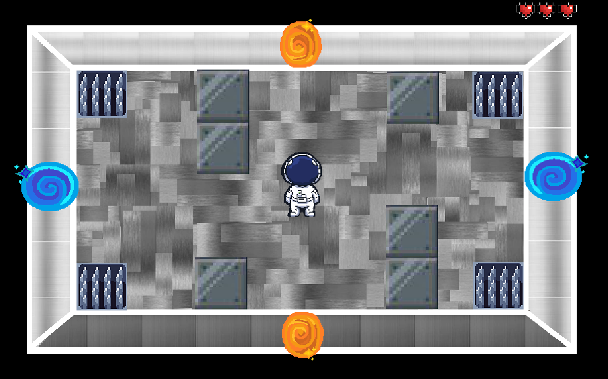
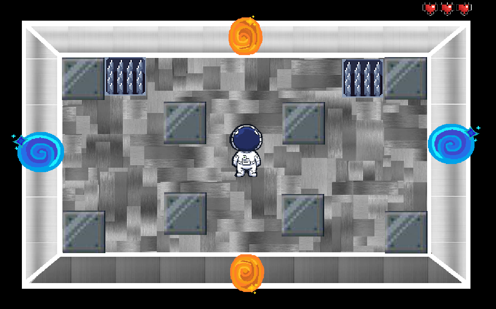

# Tytuł gry: Portal2d

## Podstawowe informacje
Portal2d to gra odbywająca się w futurystycznej przyszłości. Gra będzie typu rouge, 2d. Koncept bazuje na połączeniu mechaniki przeciwników oraz wizualizacji gry The Binding of Isaac oraz mechaniki portalu podobnego jak gry Portal. Gra jest przeznaczona dla Windows.

## Fabuła gry:
Główną postacią gry jest astronauta. Wziął udział w masowym zaludnianiu planety Kepler-62e, jest to planeta w systemie Kepler-62, 1200 lat świetlnych od Ziemi. Nagle statek zostaje zaatakowany przez piratów kosmicznych. Piraci demolują statek, wypuszczają na zewnątrz próbki badawcze, powodują wybuch głównego reaktora jądrowego. Astronauta, wybudziwszy się ze snu kriogenicznego, porusza się po ruinach statku próbując dociec się powodu abordażu. Celem Astronauty jest dotrzeć do sterowni i przejąć kontrolę nad statkiem. To zadanie nie należy do najprostszych. Sterownia znajduję się bardzo daleko od komory kriogenicznej. Główny bohater musi przejść niezliczone śluzy, aby dotrzeć do celu. Na drodze spotyka anomalie w postaci portali, fizycznych wirusów komputerowych, zepsutych androidów, wyewoluowanych sadzonek i innych przewożonych rzeczy. Czy naszemu bohaterowi uda się dotrzeć do celu?

## Techniczny opis gry:
Gra jest podzielona na piętra i pokoje. Każde piętro składa się z kilku pokoi. Aby przejść na kolejne piętro należy pokonać bossa. Pokój to jeden ekran, gdzie należy rozwiązać zagadkę logiczną, pokonać wszystkich przeciwników, otworzyć skrzynię ze skarbem lub zakupić rzeczy od handlarza. Gracz oraz przeciwnicy mogą przechodzić przez portale.
Astronauta ma pewne hp (hit points) oraz ekwipunek. W ekwipunku przetrzymuje swoje bronie, portal-gun i inne przedmioty (np przewody, mikstury).

## Szkic mapy poziomu:

Docelową postacią jest astronauta znajdujący się w wielopoziomowej przestrzeni, poruszanie się pomiędzy pokojami jest możliwe za pomocą portali.

Obiekt testowy nie może wejść w kolce - w przeciwnym wypadku spotka go utrata życia (prawy górny róg).

Różne ułożenie bloków i połapek utrudnia walkę z przeciwnikami.

## Autorzy:
    * Mateusz Kotarba
    * Konrad Małek
    * Bartłomiej Mazgaj
    * Natalia Kuchta
    * Grzegorz Lenarski
    * Jarosław Mastalerczyk

## Licencja:
Ten projekt jest objęty licencją GNU GENERAL PUBLIC LICENSE — szczegółowe informacje można znaleźć w pliku [LICENSE](/LICENSE).
