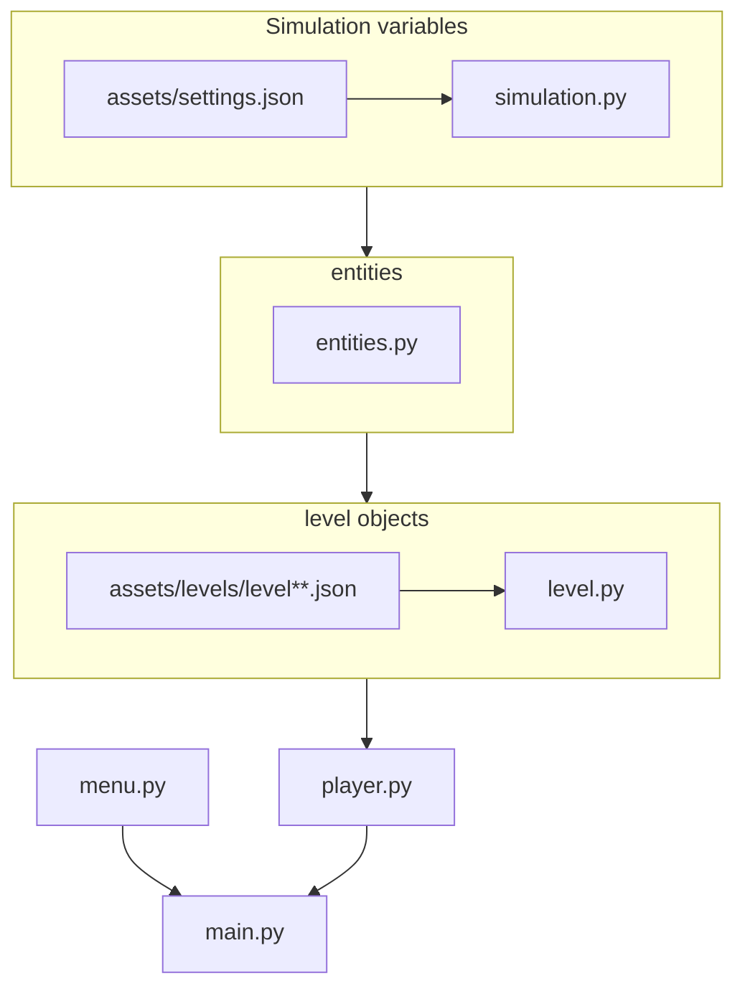

## Flowchart

## Legenda

Każdy plik poniżej importuje wszystkie pliki powyżej
* settings.json - ustawienia, które mogą być zmienione przez użytkownika
* simulation.py - parametry symulacji, wczytuje plik settings oraz zawiera informacje o klawiszach czy ilości klatek na sekundę itp (ważne ustawienie devMode = True, tylko do testowania)
* entities.py - klasa ogólna dla bytów, jak i zawiera przeciwników (może rodzielić bossów w przyszłości), zawiera też przedmioty
* level.py - wczytuje poziomy z plików, jak i definuje obiekty, które znajdują się w poziomie
* player.py - zawiera wszystkie akcje związane w graczem sterowanym, jego ekwipunek, umiejętności
* main.py - główna pętla programu
