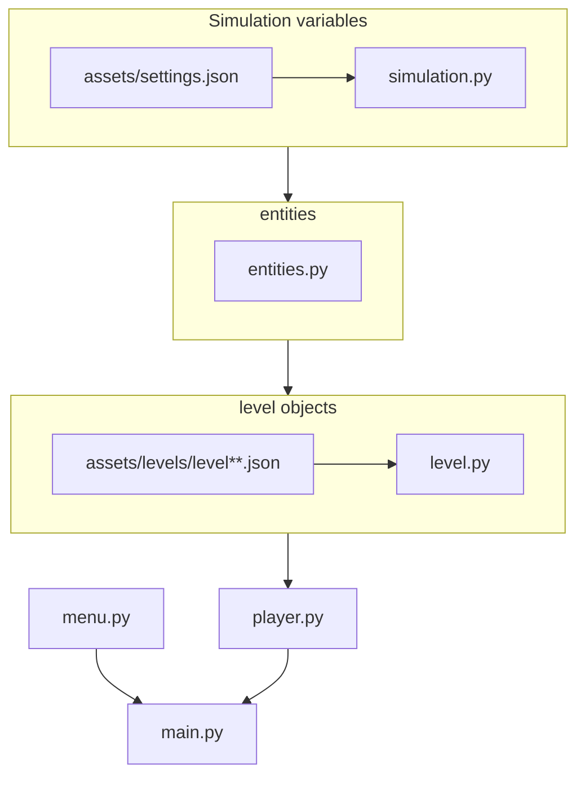

## Flowchart

## Legenda

Każdy plik poniżej importuje wszystkie pliki powyżej
* settings.json - ustawienia, które mogą być zmienione przez użytkownika
* [simulation.py](#simulation) - parametry symulacji, wczytuje plik settings oraz zawiera informacje o klawiszach czy ilości klatek na sekundę itp (ważne ustawienie devMode = True, tylko do testowania)
* [entities.py](#entities) - klasa ogólna dla bytów, jak i zawiera przeciwników (może rodzielić bossów w przyszłości), zawiera też przedmioty
* [level.py](#level) - wczytuje poziomy z plików, jak i definuje obiekty, które znajdują się w poziomie
* player.py - zawiera wszystkie akcje związane w graczem sterowanym, jego ekwipunek, umiejętności
* main.py - główna pętla programu

## simulation
* [variables](#variables)
* [get_current_scale()](#get_current_scale)
* [gameObjects](#gameobjects)
* [gameEntities](#gameentities)
* [GameObjects](#gameobjects)
* [settings](#settings)

### variables

Parametry gry
* max_velocity - maksymalna prędkość gracza
* movement_velocity - prędkość gracza przy poruszaniu się
* frame_rate - fps
* grid_size - ilość kratek na które jest podzielony poziom
* screen_size - wyjściowy rozmiar ekranu
* current_offset - offset wyświetlanej gry od ekranu, bo są rózne proporcje ekranu
* current_scale - skala obecnego ekranu od wyjściowego rozmiaru ekranu

### get_current_scale()

Mierzy obecną skalę między obecnym ekranem, a ekranem wyjściowym. Zapisuje ją w parametrach gry.

### gameObjects

Lista obiektów do wyświetlenia w grze.

### gameEntities

Lista bytów w grze.

### GameObjects

* init(object, isEntity: bool) - dodaje obiekt do listy gameObjects. Jeśli isEntity = True, to obiekt jest też w liście gameEntities
* delete(object) - usuwa obiekt z gameObjects i gameEntities
* get(name: str) - zwraca obiekt z listy gameObjects o danym imieniu
* update(collidables) - wywołuje update na każdym bycie z listy gameEntities
* blit(screen) - wywołuje blit na kązdym obiekcie z listy gameObjects

### settings

* settings_dictionary - dict z sterowaniem
* pygame_settings_dictionary - dict z mapowaniem klawiszy na pygame.K_
* load_settings() - wgrywa ustawienia z pliku settings.json
* save_settings() - zapisuje ustawniena do pliku settings.json

## entities

* [entities](#entities)
* [enemy](#enemy)

### entities

* init() - inicjuje klasę, klasa nadrzędna dla bytów
* update(collidables: List) - funkcja wyjściowa
* collide(collidables) - oblicza kolizję i ruch
* blit(screen) - wyświetla i skaluje obiekt
* collisions - lista obiektów, z którym obecnie koliduje
* position - wektor pozycji, float
* velocity - wektor prędkości, float
* rect - Rect, pozycja (int), wymiary, hitbox
* new_position - Rect, przewidywana pozycja używana do kolizji
* image - obraz w orginalnej rozdzielczości
* image_display - obraz przeskalowany do wyjściowego ekranu

### enemy

Aby zainicjować przeciwnika, należy zdefiniować:
* super().init()
* position
* image
* image_display
* rect
* rect.x, rect.y = position
* update() - wektor poruszania się oraz rodzaj kolizji

## level

* [building_block[(#building_block)

### building_block

* init(position: Tuple, isEntity: bool) - inicjuje klasę, klasa nadrzędna dla bloków
* blit(screen) - wyświetla i skaluje obiekt

